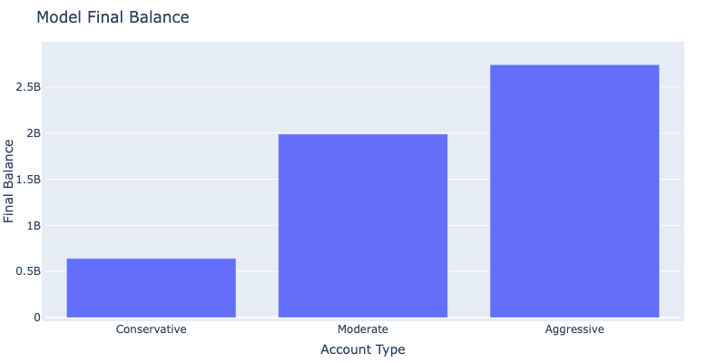
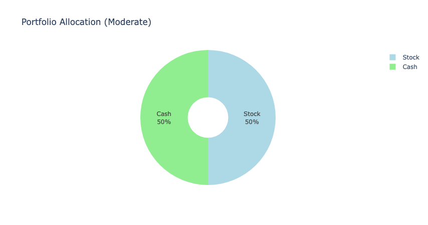
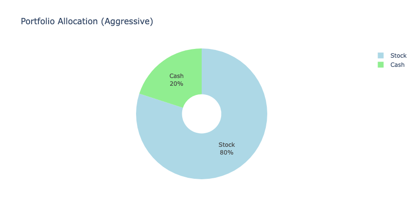

# Project 2:     Predictive Analysis with Machine Learning Models

## Project Overview
Predictive analysis plays a crucial role in numerous domains, including finance, healthcare, and marketing. In this project, we explore the intricacies of predictive analysis using machine learning techniques and models. Our aim is to generate and implore a successful machine learning model. We will accomplish this by training multiple models, and choosing the most accurate of the provided outcomes.  After testing and training data on the preferred model, provide indicators and signals. Attempt to test and train data, to accurately predict signals. Finally, we are to apply the best model to a predictive analysis of 3 kinds of investors (Conservative, Moderate, Aggressive) and choose the strategy that yields the highest results. 

## Necessary Files
• main_notebook.pynb - Contains all of our technical analysis and entails a comprehensive, yet clear instructions to replicate the scenario.

• finetuning_visualizations.ipynb - Contains the final visualizations. These visualizations have undergone training, testing, fitting and other procesees that have molded these final visualizations to be as accurate as possible.

• Images - Contains .png files of all visualizations

## Features
• Data extracting, cleasning, and preprocessing.

• Indicators and Signals: RSI and a Stochastic Oscillator.

• Various Supervised Machine Learning Models

• Summary Statistics: Obtain summary statistics after training and fitting model.

• Visualizations created using Plotly & hvPlot explaining the processed data

## Questions Asked
• Which model would yield us the best results?

• Which models performed the best? Which didn't?

• After consulting our data, which strategy (Conservative, Moderate, Aggressive) was the most             profitable?

• Are there any outliers in the data?

• What difficulties were encountered during the data analysis process or the simulation process?

## Data Analysis
• After obtaining data of our chosen stock (TSM), and preprocessing it, we then introduced two indicators to our model. The Relative Strength Index and a Stochastic Oscillator.

*Visualization of TSM stock closing price from 2000:2024*

*Visualization of TSM cumulative returns from 2000:2024*

*Visualization of TSM RSI(window=14)*

*Visualization of TSM Stochastic Oscillator(14,6,6)*
*Small side note there is a typo on the horizontal lines, but they are placed correctly at 80 & 20.*

• When both the RSI and Stochastic indicators are simultaneously lower than their respective "oversold" thresholds (30 for RSI, 20 for Stochastic), a buy signal is triggered. The amount of shares to buy is calculated as x%  of the capital (cash) in the account/portfolio. 

• Once both the RSI and Stochastic indicators are higher than their respective "overbought" thresholds (70 for RSI, 80 for Stochastic), only the shares that were previously bought via the "buy signal" are sold back to cash.

• Signals were created and defined within the model (Buy, Hold, or Sell).

*Visualization of strategy buy & sell signals shown on historical TSM closing price line plot*

• Data was split into seperate training and testing datasets. The features for this dataset included the stochastic and RSI values. The target data was the Entry/Exit signal.

•  Our Model was fitted with a RandomOverSampler

## Model Testing
__Description of Initial 4 Models:__
- Support Vector Machine (SVM): A supervised learning algorithm that classifies data by finding the hyperplane that best divides a dataset into classes.
- Gradient Boosting Machine (GBM): An ensemble learning method that builds multiple weak learners to create a strong predictive model, minimizing the loss function.
- Stochastic Gradient Descent (SGD): An optimization algorithm that iteratively updates parameters using the gradient of the loss function computed on a small subset of the training data.
- Logistic Regression: A regression model that predicts the probability of a binary outcome using a logistic function. It's commonly used for binary classification tasks.

__Initial Model Selection and Results:__

Parameters: RSI - 14, Stochastic = 14, 6, 6, Training window = 144 months
- SVM:
    - Accuracy: 0.647
    - F1-score for Buy, Hold, Sell: 0.53, 0.76, 0.06
- GBM:
    - Accuracy: 0.889
    - F1-score for Buy, Hold, Sell: 0.62, 0.94, 0.12
- SGD:
    - Accuracy: 0.543
    - F1-score for Buy, Hold, Sell: 0.59, 0.67, 0.04
- Logistic Regression:
    - Accuracy: 0.630
    - F1-score for Buy, Hold, Sell: 0.57, 0.75, 0.05

The Gradient Boosting Machine Model was chosen due to it's much higher accuracy, precision, and F1-Score.

__Fine-Tuning Process (GBM Model):__

-  Fine Tune #1:
    - Removed RSI condition from sell signal, Training window = 144 months
    - Final balance: $214,079.69, Profit/loss: $114,079.69, Accuracy: 0.866
- Fine Tune #2:
    - Removed RSI condition from sell signal, Stochastic to (5,3,3), Training window = 144 months
    - Final balance: $148,089.53, Profit/loss: $48,089.53, Accuracy: 0.851
- Fine Tune #3:
    - Removed RSI condition from sell signal, Stochastic to (5,3,3), RSI to 20, Training window = 144 months
    - Final balance: $124,489.05, Profit/loss: $24,489.05, Accuracy: 0.934
- Fine Tune #4:
    - Removed RSI condition from sell signal, Stochastic to (5,3,3), Training Window = 216 months
    - Final balance: $149,066.41, Profit/loss: $49,066.41, Accuracy: 0.816
- Fine Tune #5:
    - Removed RSI condition from sell signal, Stochastic to (14,6,6), Training Window = 216 months
    - Final balance: $215,235.24, Profit/loss: $115,235.24, Accuracy: 0.835

__Tuning of Training Window:__

- Fine Tune #6: Baseline GBM model with 72 months added to the training window.
- Fine Tune #7: Baseline GBM model with 96 months added to the training window.

__Baseline GBM model with a training window of 144 months performed the best.__

__Final Model Selection (GBM Model):__

    Best Option: Baseline GBM Model
- Training window = 144 months (12 years), RSI = 14, Stochastic = 14, 6, 6
- Final balance: $214,079.69, Profit/loss: $114,079.69, Accuracy: 0.889

__Stock/Cash Account Ratios:_

The experiment aims to demonstrate the impact of different stock/cash account ratios on final balance and profit/loss.
The experiment adds constant ratios of stock/cash outside of trades, altering the initial amount of shares and the amount bought.

The Purpose:

Showcase the effects of conservative, moderate, and aggressive strategies on final balance and profit/loss.
The model's accuracy may be slightly affected by the shift in ratios, but main features remain unchanged.
__Results:__

- Accuracy: 0.795
- Precision, recall, and F1-score for Buy, Hold, and Sell categories.
    -  Buy: Precision=0.50, Recall=0.86, F1-score=0.63
    - Hold: Precision=0.96, Recall=0.77, F1-score=0.86
    - Sell: Precision=0.49, Recall=0.89, F1-score=0.63
    - Macro average: Precision=0.65, Recall=0.84, F1-score=0.71
    - Weighted average: Precision=0.87, Recall=0.79, F1-score=0.81

This experiment provides insights into the performance of different account ratios, shedding light on their impact on trading outcomes while maintaining the model's core predictive features. Conservative (20:80), Moderate (60:40), Aggressive (80:20) strategies were evaluated with varying trade sizes (3%, 5%, 10% per trade).

__Aggressive strategy resulted in the highest final balance and profit.__

__Summary of Diffferent Allocations:__

- Conservative (20:80): 
    - Final balance: $640,797,904.92

- Moderate (60:40): 
    - Final balance: $1,989,445,834.07

- Aggressive (80:20): 
    - Final balance: $2,740,786,756.58

## Summary

In this predictive analysis project, we delved into the realm of machine learning models to forecast stock market trends. We began by exploring various models such as SVM, GBM, SGD, and Logistic Regression, eventually selecting the Gradient Boosting Machine (GBM) model due to its superior performance metrics.

Through a meticulous fine-tuning process, we optimized the GBM model by adjusting parameters like the training window, RSI conditions, and stochastic values. Ultimately, the baseline GBM model with a training window of 144 months, RSI of 14, and stochastic parameters of 14, 6, 6 emerged as the most effective.

Further exploration involved testing different stock/cash account ratios to analyze their impact on final balance and profit/loss. While these ratios slightly influenced accuracy, they did not compromise the model's core predictive capabilities. The aggressive strategy, with an 80:20 stock/cash ratio, yielded the highest final balance and profit.

Overall, this project provided valuable insights into predictive analysis using machine learning models, demonstrating their efficacy in forecasting stock market behavior. Through collaborative efforts and meticulous experimentation, we gained a deeper understanding of how various factors influence trading outcomes, paving the way for informed investment decisions.

## Credit and Contributors

    Nick Wuebben 
    Github: Nawuebben

    Jordan Romnes
    Github: Jromnes

    Jeanelle Mouelle
    Github: jmagic23
